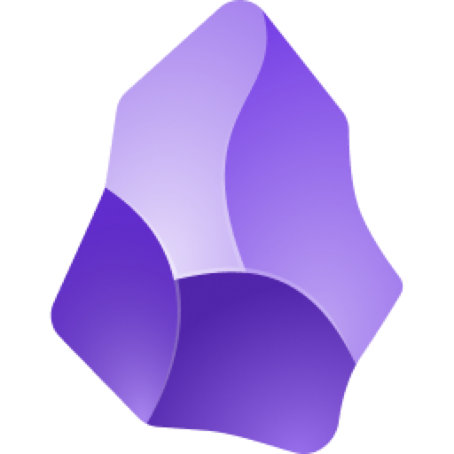
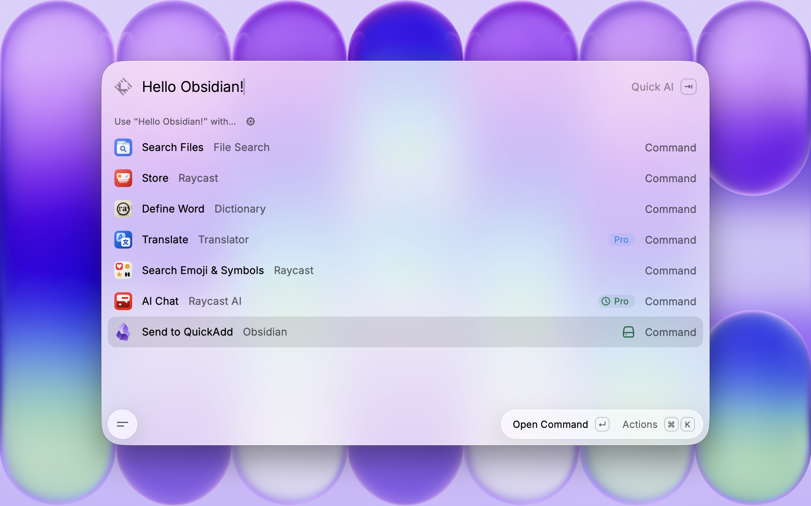
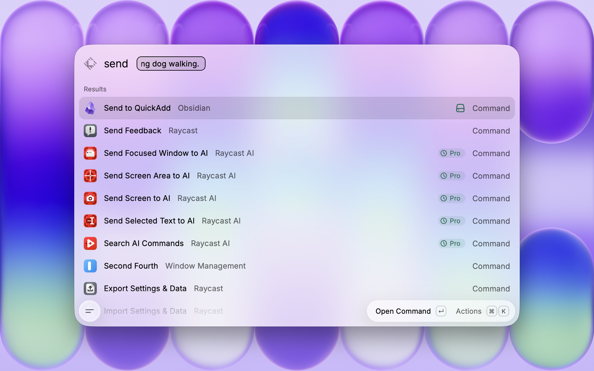
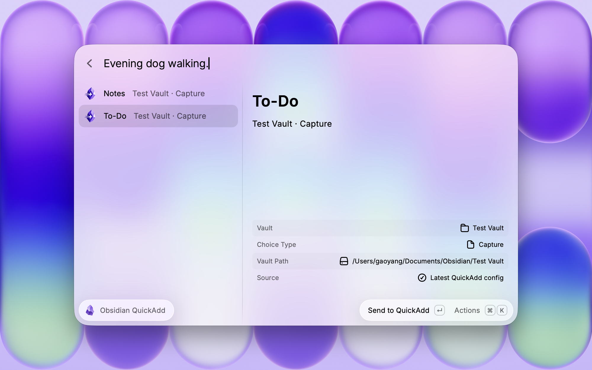
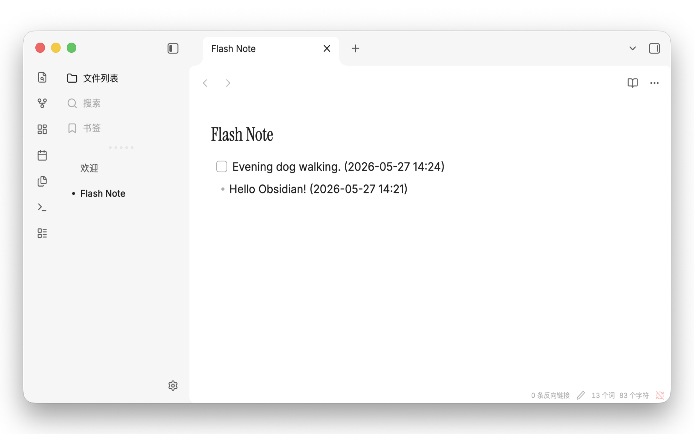

  
  <h1 align="center">Obsidian QuickAdd Extension for Raycast</h1>

⚡ Run [Obsidian QuickAdd](https://quickadd.obsidian.guide) choices from Raycast. Search choices across your vaults, enter text, and send it straight into QuickAdd.

## Features

- Automatically detects Obsidian vaults from the macOS Obsidian configuration
- Reads enabled QuickAdd choices from all detected vaults
- Supports searching and running QuickAdd choices directly from Raycast
- Supports sending selected text from Raycast Root Search through fallback commands
- Lets you edit text before sending it to a QuickAdd choice
- Supports custom QuickAdd variable names such as `{{VALUE:value}}`
- Supports an optional fixed vault path when automatic detection is not enough

## Commands

- `Search QuickAdd Choices`: search available QuickAdd choices and enter text before running one.
- `Send to QuickAdd`: send text from Raycast Root Search or a command argument directly to a QuickAdd choice.

## Author

[ 🇨🇳 ] **gaoyang**

- [GitHub](https://www.github.com/gaoyang)

## Preview

## Portal

- [Raycast Obsidian QuickAdd](https://github.com/raycast/extensions/tree/main/extensions/obsidian-quickadd)
